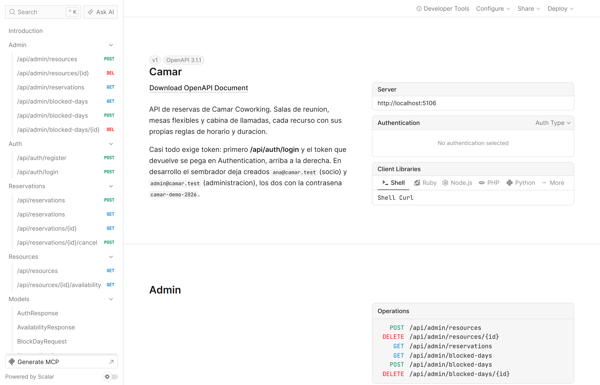
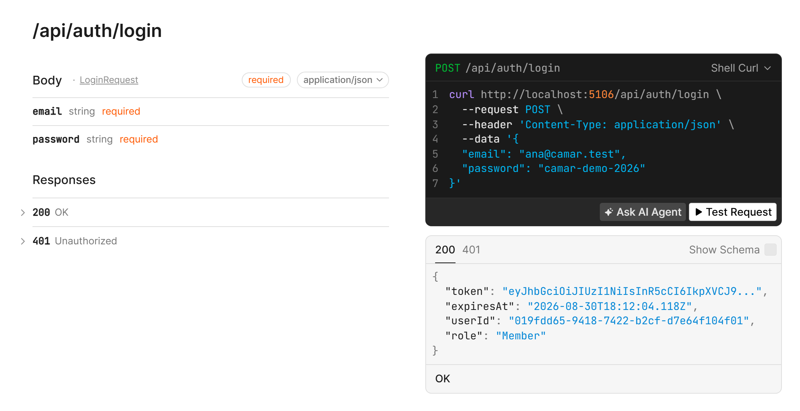
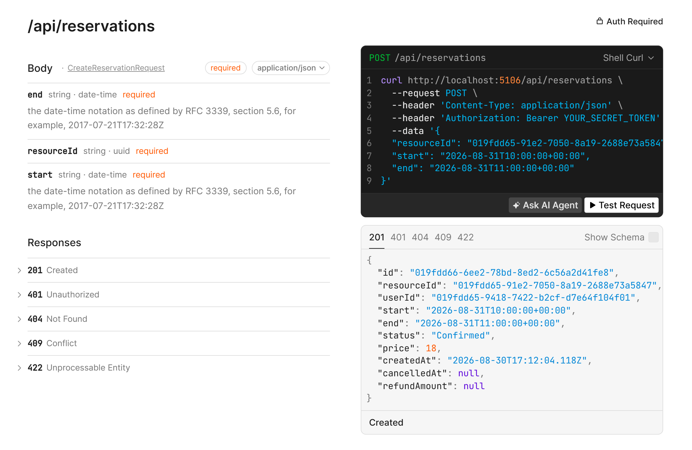
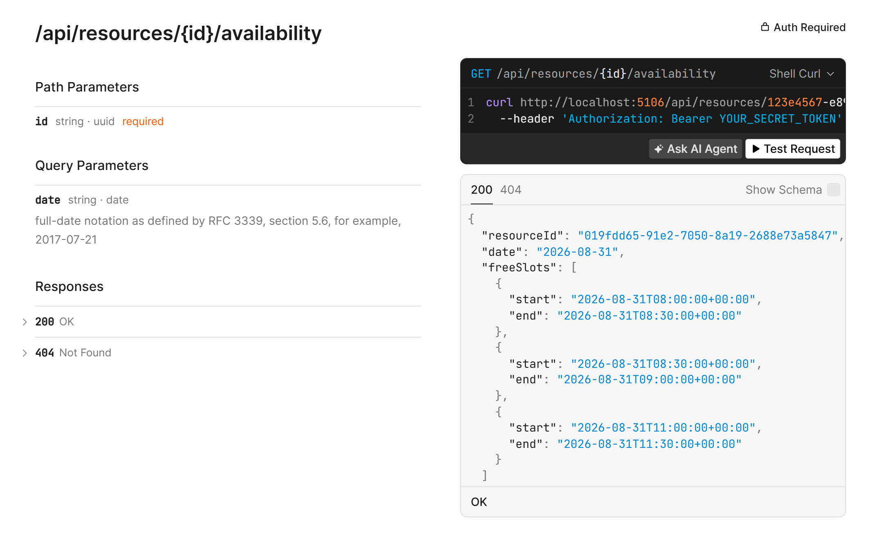
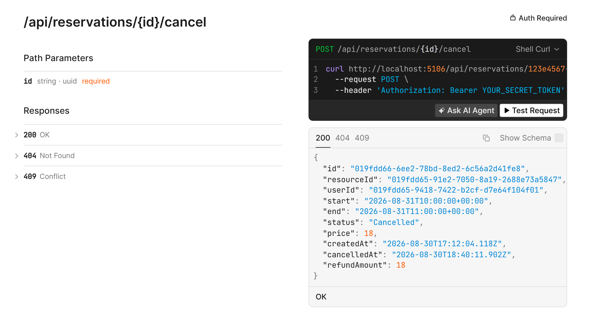

# Camar

API de reservas para un coworking. El espacio es inventado, pero las reglas intentan
parecerse a las de uno real: hay tres tipos de recurso, cada uno con sus condiciones, y casi
todas las reglas chocan entre sí en algún punto.

Lo monté para practicar dos cosas que me interesaban: modelar un dominio con reglas que se
pisan unas a otras, y resolver bien el problema de que dos personas reserven lo mismo a la
vez. Esto último acabó siendo la parte más interesante con diferencia.

## Cómo se ve

La API se documenta sola con [Scalar](https://scalar.com), en `/scalar` y solo en desarrollo.
Además de leerla, desde ahí se lanzan peticiones sin salir del navegador.



Catorce operaciones repartidas en cuatro grupos. El panel de la derecha es donde se pega el
token: sin él casi todo contesta 401.



Login y registro son los dos únicos endpoints abiertos, y se les nota en que no llevan
candado. Devuelve el token, cuándo caduca y el rol, que es lo que decide si aparecen los
endpoints de administración.



Una hora de sala en franja punta: 18 €, dos bloques de media hora con el recargo aplicado.
Arriba a la derecha el candado de *Auth Required*, y abajo los cinco desenlaces posibles. El
409 es el del hueco ya cogido; el 422, el de las reglas del coworking.



Lo que queda libre de un recurso en un día, en bloques de media hora. Aquí salta de las 09:00
a las 11:00 porque ese hueco ya está reservado.



Al cancelar se devuelve la reserva con lo que se reembolsa. Con más de 24 horas de antelación
salen los 18 € enteros; por debajo de eso la política empieza a recortar.

## Stack

- .NET 10, ASP.NET Core con controllers
- PostgreSQL 18 y EF Core 10 (Npgsql)
- JWT para autenticación, BCrypt para las contraseñas
- xUnit, y Testcontainers para los tests de integración
- Scalar en `/scalar` para consultar la API y probarla a mano

## Cómo levantarlo

Hace falta PostgreSQL y, para los tests de integración, Docker.

```
dotnet user-secrets set "ConnectionStrings:Camar" "Host=localhost;Database=camar;Username=postgres;Password=..." --project src/Camar.Api
dotnet user-secrets set "Jwt:SigningKey" "una clave larga y aleatoria" --project src/Camar.Api

dotnet ef database update --project src/Camar.Infrastructure --startup-project src/Camar.Api
dotnet run --project src/Camar.Api
```

En Development se cargan datos de ejemplo: cinco recursos y tres usuarios
(`admin@camar.test`, `ana@camar.test`, `luis@camar.test`), todos con la contraseña
`camar-demo-2026`. Los ids se generan al vuelo y salen en el log de arranque.

`dotnet test` ejecuta todo. Los tests de dominio son instantáneos porque no tocan la base de
datos; los de integración levantan un Postgres en un contenedor, así que tardan unos segundos.

## Las reglas del coworking

Las inventé yo, pero intenté que fueran específicas en lugar de genéricas, porque un CRUD de
reservas sin reglas no tiene ninguna gracia.

- Todo va en bloques de media hora. Las reservas empiezan y terminan en punto o y media.
- Las salas de reunión se reservan entre 30 minutos y 4 horas.
- La cabina de llamadas es de uso exprés: una hora como máximo.
- Las mesas flexibles van por media jornada o más, mínimo 4 horas. No se alquilan por ratos.
- Abre de lunes a viernes de 8:00 a 21:00 y los sábados de 9:00 a 14:00. Domingos cerrado.
- El administrador puede bloquear días sueltos (festivos, obras, lo que sea).
- El plan Flex reserva con hasta 7 días de antelación; el Day Pass, solo hoy y mañana.
- El precio va por bloque según el tipo de recurso, con un recargo del 50% entre las 9:00 y
  las 18:00.
- Cancelando con 24 horas o más se devuelve todo; entre 3 y 24 horas, la mitad; con menos de
  3 horas no se devuelve nada.

## Decisiones que me parecen las importantes

### El solapamiento lo impide Postgres, no mi código

Esta es la decisión central del proyecto. La forma ingenua de evitar reservas solapadas es
consultar si el hueco está libre y luego insertar, pero entre esas dos operaciones hay una
ventana en la que dos peticiones simultáneas pasan las dos la comprobación.

En vez de pelearme con bloqueos en la aplicación, delegué la integridad a la base de datos con
una constraint de exclusión:

```sql
ALTER TABLE reservations
ADD CONSTRAINT ck_reservations_no_overlap
EXCLUDE USING gist (resource_id WITH =, period WITH &&)
WHERE (status = 1);
```

Se lee así: rechaza la fila si ya existe otra del mismo recurso cuyo periodo se solape. El
`WHERE` es la parte que más tarde en entender: sin él, una reserva cancelada seguiría
bloqueando su hueco para siempre.

El servicio sigue haciendo una comprobación previa, pero solo para devolver un mensaje
decente. La garantía de verdad es de la base de datos.

### Los periodos son intervalos medio abiertos

Un periodo va de inicio incluido a fin excluido, `[inicio, fin)`. Parece un detalle menor y
resulta que no lo es: gracias a eso, una reserva de 18:00 a 19:00 y otra de 19:00 a 20:00 no
se consideran solapadas. Con intervalos cerrados el minuto de las 19:00 pertenecería a las
dos y saldría un conflicto falso.

Ese criterio se mantiene igual en el objeto de dominio, en la conversión a `tstzrange` y en el
operador `&&` de Postgres. Hay un test para cada capa porque es justo el sitio donde metería
la pata al tocar algo.

### Guardar el periodo como una sola columna me salió caro

Mapeé el periodo a una columna `tstzrange`. Queda elegante y la constraint sale natural,
pero tiene un precio que no vi venir: EF Core no puede traducir `r.Period.Start` a SQL,
porque para él esa columna es un rango opaco. La primera consulta que ordenaba por fecha de
inicio reventó con un 500.

Al final bajé a SQL directo con `FromSql` y el operador `&&` para la búsqueda de solapamientos,
y ordeno en memoria las reservas de un usuario (son pocas). La alternativa habría sido guardar
inicio y fin en dos columnas y calcular el rango aparte, que es más fácil de consultar pero
menos limpio para la constraint. Elegí una y me comí su desventaja.

### El precio se congela al reservar

Se calcula al crear la reserva y se guarda ahí. No se recalcula nunca. Si mañana subo las
tarifas, las reservas antiguas siguen costando lo que costaron. Recalcular sería reescribir el
pasado. Todo el dinero va en `decimal`, nunca en `double`.

### El tiempo entra como parámetro

Ninguna regla lee el reloj por dentro. Las políticas de dominio reciben la fecha y los
servicios reciben un `TimeProvider`. Si `MembershipPolicy` llamara a `DateTime.Now`, no habría
forma de testear la antelación de forma determinista.

### Cómo están repartidas las capas

`Domain` no depende de nada y contiene las reglas puras. `Application` define interfaces de
repositorio y orquesta los casos de uso. `Infrastructure` implementa esas interfaces con EF
Core. `Api` es el punto de composición.

Los errores de Postgres se traducen a excepciones de dominio dentro de `Infrastructure`, para
que la capa de aplicación no sepa que existe Npgsql. Son cuatro (`NotFoundException`,
`BusinessRuleException`, `ConflictException` y `UnauthorizedException`) y la API las convierte
en 404, 422, 409 y 401 con ProblemDetails. Empecé a hacer una clase por cada regla incumplida
y me pareció ceremonia sin ganancia.

### Seguridad

- El identificador del usuario sale siempre del token, nunca del cuerpo de la petición. Al
  principio lo mandaba el cliente y cualquiera podía reservar en nombre de otro cambiando un
  GUID.
- Tocar una reserva ajena devuelve 404 y no 403. Un 403 estaría confirmando que ese id existe.
- El login responde lo mismo si el email no está registrado que si la contraseña falla.
- El registro público siempre crea usuarios normales. Para administrador hay que promocionar
  a mano.
- La cadena de conexión y la clave de firma van en user-secrets, nunca en `appsettings.json`.

## El deadlock que no esperaba

El test que más me interesaba era el de concurrencia: 24 peticiones a la vez peleando por el
mismo hueco, y comprobar que solo entra una. Lo escribí, pasó, y me quedé tranquilo.

Luego lo ejecuté varias veces seguidas y fallaba más o menos una de cada cinco.

Resulta que con esa concurrencia Postgres no siempre devuelve `23P01`
(`exclusion_violation`). La constraint hace que cada transacción espere a ver si la anterior
confirma, y con suficientes peticiones esas esperas se cruzan y Postgres detecta un deadlock:
`40P01`. Mi repositorio solo traducía el `23P01`, así que el deadlock se escapaba sin capturar
y le llegaba al cliente como un 500 en lugar de un 409.

Para encontrarlo tuve que recorrer la cadena entera de excepciones, porque EF lo envuelve en
tres capas: `InvalidOperationException` sobre `DbUpdateException` sobre `PostgresException`.
Ahora trato los dos códigos como el mismo conflicto de negocio, que para quien está reservando
es lo que significan: alguien se te ha adelantado.

Después del arreglo, diez ejecuciones seguidas sin un solo fallo. Es el bug del que más he
aprendido de todo el proyecto, y no lo habría encontrado probando a mano.

## Lo que no hace

- **Zonas horarias.** Doy por hecho que el offset que llega ya es la hora local del coworking,
  en lugar de convertir el instante con `TimeZoneInfo`. Con un cliente en otro huso, o en el
  fin de semana del cambio de hora, las comprobaciones de horario no serían correctas. Es la
  limitación que más me molesta.
- No hay refresh tokens. El access token dura una hora y se acabó.
- No hay pasarela de pago. Calculo el precio y lo guardo, pero no se cobra nada.
- No se pueden hacer reservas recurrentes del tipo "todos los lunes".
- No hay avisos por correo ni notificaciones.
- El equipamiento de las salas (proyector, pizarra) no está modelado. Lo dejé fuera a
  propósito para no complicar el mapeo antes de tiempo.

## Siguientes pasos

Lo primero, las zonas horarias. Después me gustaría añadir paginación y filtros en los
listados, y un workflow de GitHub Actions que ejecute los tests en cada push. Y hay una mejora
que tengo pendiente desde el episodio del deadlock: en lugar de devolver un conflicto directo,
reintentar la operación una vez, porque una transacción víctima de un deadlock normalmente
tiene éxito al segundo intento.
